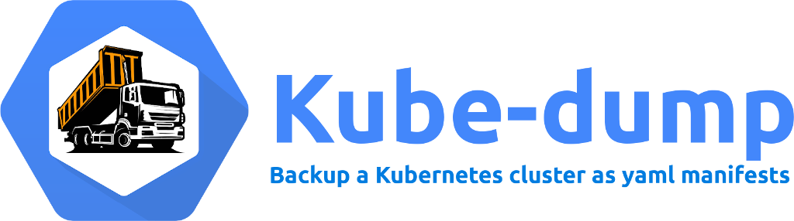

# Kube-dump

Backup a Kubernetes cluster as yaml manifests


## Commands and flags

```
./kube-dump [command] [[flags]]

Available Commands:
  dump-namespaces    Dump namespaced kubernetes resources
  dump-cluster       Dump cluster wide kubernetes resources
  dump               Dump all kubernetes resources

Flags:
  -h, --help                    This help
  -s, --silent                  Execute silently, suppress all stdout messages
  -d, --destination-dir         Path to dir for store dumps, default ./data
  -f, --force-remove            Delete data directory before launch

Kubernetes flags:
  -n, --namespaces              List of kubernetes namespaces
  -r, --namespaced-resources    List of namespaced resources
  -k, --cluster-resources       List of cluster resources
      --kube-config             Path to kubeconfig file
      --kube-context            The name of the kubeconfig context to use
      --kube-cluster            The name of the kubeconfig cluster to use
      --kube-insecure-tls       Skip check server's certificate for validity

Git commit flags:
  -c, --git-commit              Commit changes
  -b, --git-branch              Branch name
      --git-commit-user         Commit author username
      --git-commit-email        Commit author email
      --git-remote-name         Remote repo name, defualt is origin
      --git-remote-url          Remote repo URL
  -p, --git-push                Push commits to origin

Archivate flags:
  -a, --archivate               Create archive of data dir
      --archive-rotate-days     Rotate archives older than N days
      --archive-type            Archive type xz, gzip or bzip2, default xz
```

## Run in docker

```shell
docker run -ti --rm -v $HOME/.kube:/.kube woozymasta/kube-dump:latest \
  dump-namespaces -n dev,prod --kube-config /.kube/config
```
