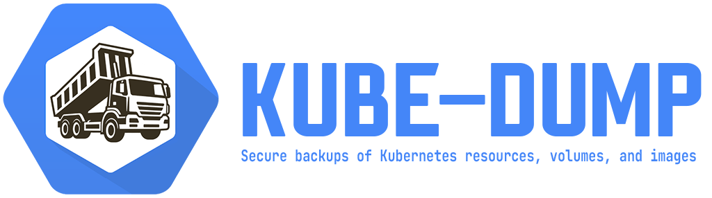

# kube-dump



kube-dump saves three parts of Kubernetes state:

* Kubernetes resources as YAML;
* PVC data;
* container images used by Pods.

These parts are independent.
You can save only YAML, only volumes, or only images.
A complete environment backup usually needs all three.

The complete list of commands and flags
is available in the [CLI reference](../cli.md),
and all profile fields are documented in the [profile reference](../profile.md).
Practical rules for environment variables, shell completion,
and documentation generation are described in [CLI usage](usage/cli-usage.md).

Install kube-dump by following
[installation and usage](installation/overview.md) before the first run.

## Quick start

Save resources to a local directory:

```shell
kube-dump resource save dir ./backup
```

Save PVC data to a local directory:

```shell
kube-dump pvc save dir ./backup
```

Save the container images in use to a local directory:

```shell
kube-dump image save dir ./backup
```

The same commands can save to S3;
only the backend and destination change:

```shell
kube-dump resource save s3 --s3-uri s3://backup/prod/
kube-dump pvc save s3 --s3-uri s3://backup/prod/
kube-dump image save s3 --s3-uri s3://backup/prod/
```

A single local directory or S3 prefix can be used for all three data types.

## Resources

`resource` reads Kubernetes objects, applies a profile, and saves YAML.

```shell
kube-dump resource save dir ./backup --profile backup
```

Saved YAML can be piped directly to `kubectl`:

```shell
kube-dump resource cat dir ./backup | kubectl apply -f -
```

See [Kubernetes resources](usage/resource.md).

## PVCs

`pvc` saves the filesystem of each selected PVC into a separate archive.

```shell
kube-dump pvc save dir ./backup
```

By default, kube-dump uses a volume snapshot
and reads its copy instead of accessing the application's live PVC directly.

See [PVC data](usage/pvc.md).

## Images

`image` looks at running Pods and saves the container images they use.

```shell
kube-dump image save dir ./backup
```

Images are stored as a regular OCI Image Layout
without a kube-dump-specific format.

See [Container images](usage/image.md).

## Profiles

A profile defines rules for resources, PVCs, and images.

```shell
kube-dump profile show backup
```

You can use a built-in profile, a file from Git, or an installed local profile.

See [Profiles](usage/profiles.md).

## Encryption

Individual YAML fields can be encrypted with AGE or AES-SIV.

Resource and PVC archives use AGE encryption.

See [Encryption](usage/encryption.md).

## Running kube-dump

kube-dump can be run manually, from CI, or on a schedule inside Kubernetes.

See [Installation and usage](installation/overview.md).
